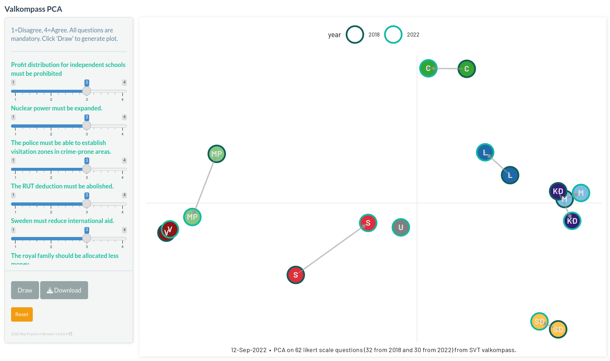

# shiny-certificate

[](https://github.com/royfrancis/shiny-valkompass/actions?workflow=build) [](https://hub.docker.com/repository/docker/royfrancis/shiny-valkompass)

This is an R shiny app to create a political compass.



## Running the app

### Run online

Click [here](https://valkompass.serve.scilifelab.se) to access an online instance of this app. This link may not always be active.

### Run using docker

```
docker run --rm -p 8787:8787 royfrancis/shiny-valkompass:v1.0.0
```

The app should be available through a web browser at `http://0.0.0.0:8787`.

### Run in R

Install the following R packages:

```
install.packages(c("dplyr", "ggplot2", "ggh4x", "shiny", "shinythemes", "showtext"))
```

This repo is not an R package. Clone this repo and execute the R command `shiny::runApp("app.R")` in the root directory.

2022 • Roy Francis
